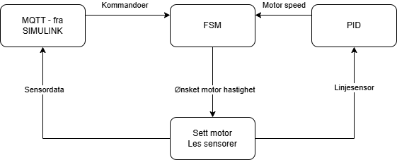

# Arduino kode til Oppstartsuka BIAIS 2025

README'en fungerer som overordnet dokumentasjon for koden skrevet til oppgaven.  
Merk at koden ikke skal sees på av studentene så til enhver som gjør endringer i fremtiden trenger ikke ta hensyn til dette.  

## Kode

### Reflectance sensor array
Ettersom vi bruke Arduino uno r4 WiFi, som ikke bruker arduino sin vanlige AVR arkitektur (bruker en renesas mikrochip) så er det en del biblioteker som ikke fungerer (enda?) da den er ganske ny. Fra zumo-bil bilioteket er det 2 biblioteker som ikke fungerer: Buzzer (for å lage lyd) og lightreflectance sensor arrayet, skyldes i hovedsak at det er stor forskjell på hvordan timerene fungerer. Det er en fare for at flere biblioteker ikke fungerer som forventet men disse to er de eneste funnet.

Buzzer er ikke noe problem med mindre det skal implementeres i fremtiden. For å få linjefølger sensoren til å fungere er det skrevet et eget bibliotek som burde fungere ganske likt som originalen. Merk at den kun fungerer på linjefølgerene som har 6 sensorer (modell irs04a). Vet at hvertfall ELSYS har noen av modellen med 5 sensorer, biblioteket burde fungere på den med noen små justeringer, funksjonalitet for å bruke versjoner med andre antall sensorer er halvveis implementert, men alle sensorene på VIPS var av typen med 6 IR-emittere. Funksjonaliteten er ganske enkel, og har noen grunnlegende funksjoner, tror det dekker mesteparten av standardbiblioteket:  
- setCalibrate  
    - Resetter kalibreringsstatus
- calibrate_line_sensor
    - Returnerer en tuple med 2 ints og en bool. Disse representerer hhv venstre, høyre fart, om kalibrering er ferdig
    - Funksjonen må kalles på kontinuerlig til boolen returnerer true
- read_raw
    - Leser fra sensorene, det er denne som lagde problemer antar jeg.
    - Fungerer ved å sette pins til sensorene høye i 10 mikrosek, og måle tiden det tar før de går lavt
    - Funksjonen bruker også kalibreringsdata, og returnerer en verdi mellom 0 og 1000 (høyere verdi -> lysere underlag)
- read_line
    - Kaller på read_raw, og normaliserer verdiene til de 6 sensorene
    - returnerer en verdi mellom +/- 2500. lav verdi -> linjen ligger til venstre for bilen (fact sjekk denne)

### PID
PID. veldig enkel. Bruker binære semaforer gjennom get og set funksjoner for å kunne lese/endre vareabler og tilstander utenfor objektet. Trådsikker. Selve PIDen er veldig enkel, men trenger ikke noe mer for prosjektet her.

### FSM
Skulle bytta navn på fila og, men selve klassen heter nå hvertfal ZumoCommandHandler. Inneholder også et par tilhørende Enums. Er bare en finite state machine for å få inn kommandoer fra matlab, og få ut motorhastighet til hvert av hjulene.
Her brukes også get/set kommandoer med binære semaforer for å gjøre den trådsikker. Relevante funksjoner er:
- append_command
- handle_last_command
- get_wanted_motor_speed  
Håper disse er selvforklarende. 

### MQTT
Setuper til MQTT må dere spørre adrian om. Det er vanlig MQTT protokoll over Arduinoen sitt WiFi-brett (ESP).

## Informasjonsflyt
Programmet er delt opp i 3 tråder, men det er i praksis 4 deler, FSM-en og lesing av sensordata skjer i samme tråd. Dette kan (bør?) deles opp, men informasjonsflyten følger flowchartet under:

## TODO
Prøve å dele opp i prioriteter i et par minutter, virket som det fort ble startvation. Ser også ut til at de 3 trådene kjører ca like ofte med lik prioritet selvom de er satt til ulike perioder. Mest sansynlig noe som kan optimaliseres litt, selvom det kanskje er en liten feil ett sted da det så ut som PID'en alene var nok til å nesten starve systemet på 100ms periode (burde ikke gjort det), virket som den egentlig kjørte en del fortere. Skal se på det. Kanskje. Fungerer nå uansett da, men de 3 trådene kjører med lik prioritet som ikke egentlig er et problem for nå.  
Kode kvalitet. Er fortsatt litt rotete noen steder, kan sikkert kutte ned litt og dele inn i bedre brukergrensesnitt i de ulike klassene men prioriterer å bli ferdig med oppgaven for nå.

