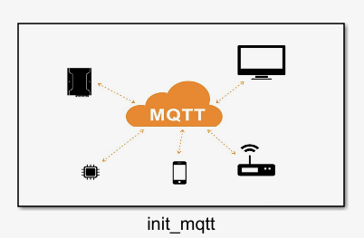
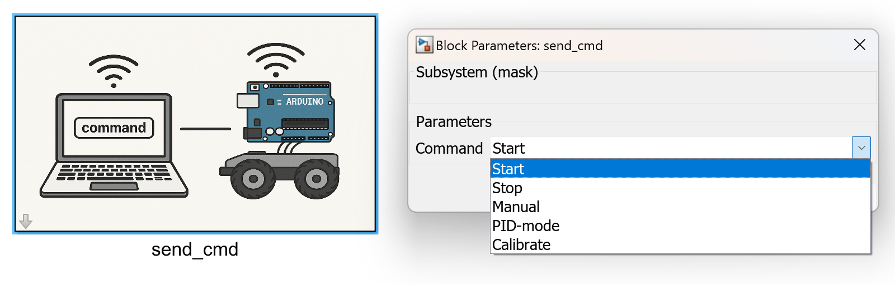
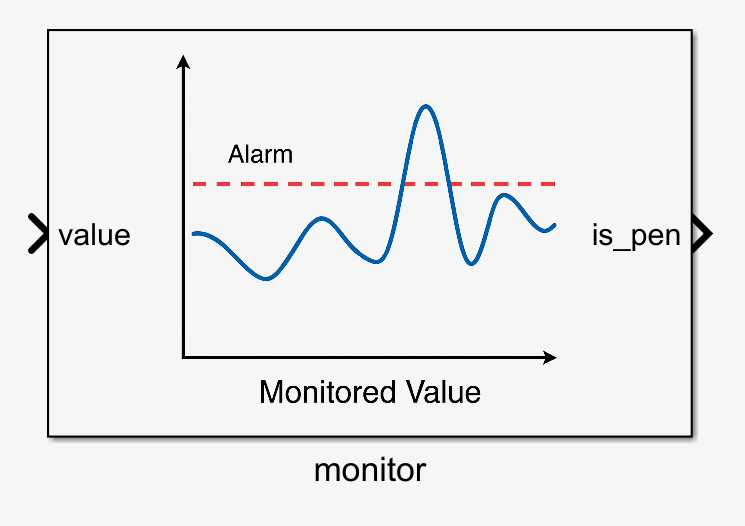

# 📘 Dokumentasjon for Simulink MQTT-bibliotek

Denne dokumentasjonen dekker bruk av Simulink-blokker som grensesnitt mot MQTT-biblioteket i MATLAB. Biblioteket er delt i tre hovudkomponentar: **init**, **read**, og **send**.

Rask stadefesting.
- **Parameter** referer til verdier man kan edre ved å klikke på blokka.
- **Inputs** er signaler inn i blokka.
- **Outputs** er sugnal ut av blokka.

---

## 🧭 Innhald

- [1. Init](#1-init)
  - [1.1. `init_mqtt`](#12-init_mqtt)
  - [1.2. `initOppstartsveka`](#13-initoppstartsveka)

- [2. Read (lesing frå sensorar)](#2-read-lesing-frå-sensorar)
  - [2.1. `ReadLine`](#21-readline)
  - [2.2. `read_encoder`](#22-read_encoder)
  - [2.3. `read_accel`](#23-read_accel)
  - [2.4. `read_gyro`](#24-read_gyro)
  - [2.5. `read_mag`](#25-read_mag)

- [3. Send (skriving til MQTT)](#3-send-skriving-til-mqtt)
  - [3.1. `send_speed`](#31-send_speed)
  - [3.2. `send_PID`](#32-send_pid)
  - [3.3. `send_cmp`](#33-send_cmp)
  - [3.4. `monitor`](#34-monitor)

---

## 1. Init

Blokkene i denne seksjonen gjer nødvendig oppsett for å kople til MQTT-brokeren og gjere klar delt datatilgang for sensorverdiar.

### 1.1. `init_mqtt`

> Denne lar deg initialisere ein mqtt klient for alle TCP -brokera


Bolkka tilegner bil-ID'en i workspace subscriber på førhandsdefinerte topics i {root}/topics/MQTTTopics.m, og set opp MQTT-kommunikasjon
**Argumenter**
- **Obligatorisk**
    - Car ID 
    - Broker IP/nettadresse
    - Port
- **Valfritt**
    - Brukarnamn
    - Passord

Funksjonen benytter seg så av å kalle mqtt(..) av argumenta som blokken initierast med. 
Sjå mqtt.m for nærare dokumentasjon.



### 1.2. `initOppstartsveka`

> Standard MQTT-oppsett for oppstartsveka med lokal broker.

Bolkka tilegner bil ID'en i workspace subscriber på førhandsdefinerte topics i {root}/topics/MQTTTopics.m, og set opp MQTT-kommunikasjon med førehandsdefinert broker
og autentisering tilpassa Raspberry Pi-baserte system brukt under oppstartsveka.

**Parameter:**
- CAR_ID – heiltal som identifiserer bilen (brukast i topicar og ID)
Bruker fast oppsett:
- Broker IP : 192.168.1.3  
- Port      : 1883  
- Brukarnamn: 'BIAISbroker'  
- Passord   : 'shinyteapot294'

Funksjonen benytter seg så av å kalle mqtt(..) av argumenta som blokken initierast med. 
Sjå mqtt.m for nærare dokumentasjon.


---

## 2. Read (lesing frå sensorar)

Desse blokkene les verdiar frå den globale `SensorData`-instansen og eksponerer dei som utgangsportar i Simulink. Kvar blokk er direkte knytt til ein spesifikk MQTT-topic gjennom den tilhøyrande callback-funksjonen, og gir dermed alltid tilgang til den nyaste verdien som er motteken for det aktuelle topicet.

Blokkene har inga konfigurasjon eller inngangsparameter – dei opererer fullt ut basert på intern deling av data og krev ingen manuell initiering utover systemoppsettet (`init_mqtt`). Dei eignar seg godt for kontinuerleg overvaking av sensorar i sanntid.

### 2.1. `ReadLine`

Gir ut den nyaste verdien som er motteken frå linjesensor-topicen. Blokka returnerer éin skalarverdi, der 0 er midtpunktet.

### 2.2. `read_encoder`

Encoder-blokka finst i to variantar:

* Éin versjon med to separate utgangar: `left` og `right`
* Éin versjon med éin vektorutgang: `[left, right]`

Merk: På tidspunktet for utvikling hadde bilane ikkje faktiske enkodarar, men systemet er klart til å ta imot slike data om det blir aktuelt.

### 2.3. `read_accel`

Akselerometer-data kan lesast på to måtar:

* Éin versjon med tre separate utgangar: `x`, `y`, `z`
* Éin versjon med éin 3D-vektor: `[x, y, z]`

### 2.4. `read_gyro`

Gyroskop-blokka har tilsvarande to variantar:

* Separate utgangar for `x`, `y`, `z`
* Éin vektorutgang `[x, y, z]`

### 2.5. `read_mag`

Magnetometer-blokka kjem òg i to variantar:

* Med tre individuelle portar: `x`, `y`, `z`
* Med éin samla vektor `[x, y, z]`


---

## 3. Send (skriving til MQTT)

Blokkene i denne seksjonen sender styringsdata eller statusmeldingar til MQTT-topicar. Dei er designa for bruk i simulering og kontroll av roboten via trådlaus kommunikasjon.

Alle blokkane:

* Sender berre når inngangsverdien faktisk endrar seg.
* Støttar at parameterverdiar kan endrast under simulering dersom simuleringstida er sett til ∞ (`inf`).
* Har anten parameter eller input – aldri begge samtidig – for å gjere bruk enklare og tydeleg.

---

### 3.1. `send_speed`

Blokka sender fartsinformasjon for venstre og høgre hjul. Det finst to variantar:

* Éin versjon med **to separate inngangsportar**: `left` og `right`
* Éin versjon med **parameterar** for `left` og `right`, som kan endrast manuelt

Begge sender på topic `speed` som ein kommaseparert streng: `ID,left,right`.

---

### 3.2. `send_PID`

Blokka sender PID-parametrar for regulering. To utgåver finst:

* Éin med tre separate **input-portar**: `P`, `I`, `D`
* Éin med **parameterbasert konfigurasjon** av same verdiar

Sender på topic `pid` med melding: `ID,P,I,D`.

---

### 3.3. `send_cmd`

Blokka sender kommandoar som tekststrengar til topic `cmd`.

* Har ein **dropdown-meny** med eit sett av førehandsdefinerte kommandoar
* Du kan òg skrive inn eigen tekst manuelt
* Sender berre melding når verdien i feltet endrar seg

**Merk:** Meldinga må vere under 20 byte. Blokka sørger for dette internt ved å padde meldinga til `1x20` før sending.



---

### 3.4. `monitor`

Denne blokka overvakar ein inngangsverdi og triggar ein alarm når verdien overstig ein fast terskel.

* **Input:** Éin verdi (t.d. absolutt avvik)
* **Utgang:** `is_pen` blir sett høg (1) dersom alarmen går
* Sender `"penalty"`-kommando over MQTT (på topic `cmd`) ved overskriding

Bruken er spesielt tilpassa linjesensorens avvik, der t.d. integralfeil blir akkumulert og brukt til å utløysa ei straffemelding.

**Terskelverdi:** Hardkoda til `4000`. Dette er bevisst gjort for å hindre at brukarar endrar verdien under simulering og dermed **jukser**.



---

## 🧩 Tips

* Alle send-blokker brukar `mqtt_send(...)` internt
* Alle read-blokker nyttar `sensor_ref("get")` og hentar verdiar frå `SensorData`

---

## 🔗 Sjå også

* [`README.md` for callback-systemet](../topic_callback/README.md)
* [`mqtt.m` for meir om init](../mqtt.m)
* [`SensorData.m`](../Sensors/SensorData.m)
* [`mqtt_subscribe.m`](../mqtt_subscribe.m)

```
