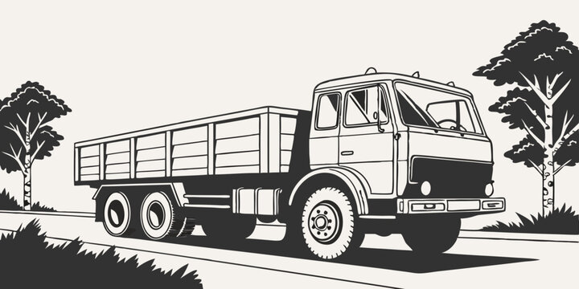
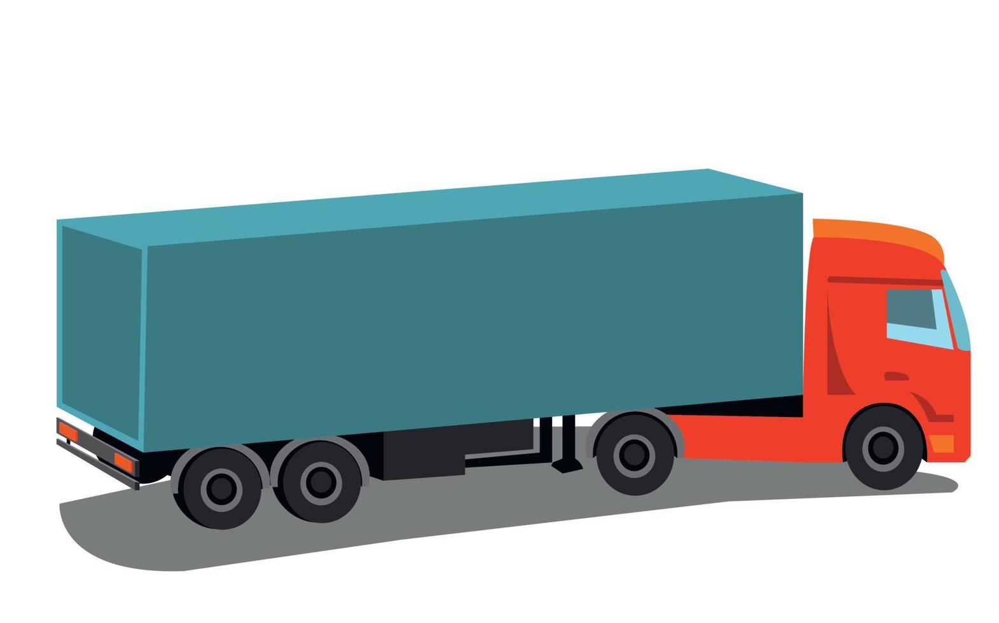
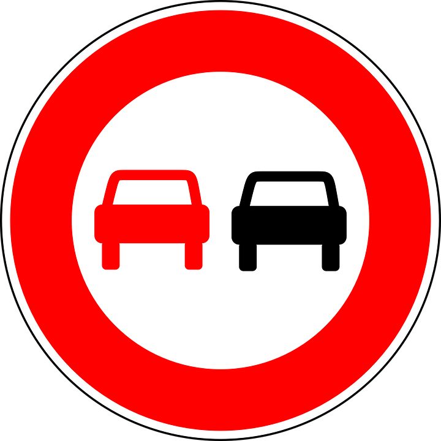

# 🚚 Truck-bibliotek for Simulink

Dette biblioteket inneheld blokker som simulerer kjøretøy og trafikkrelaterte funksjonar i Simulink. Blokkene er modulariserte og visuelt representert for enkel testing, kontroll og animasjon av lastebilar og trafikkhendingar som forbikøyring.

Ein del av dynamikken i lastebilmodellen er bevisst skjult for å forenkle opplevinga for studentar. Spesielt er styringa av hengaren implementert som ein kaskaderegulator, men berre den ytste reguleringssløyfa er eksponert. Den indre PID-regulatoren, som kontrollerer vinkelen mellom trekkvogna og hengaren, er førehandsjustert og ikkje synleg i modellen.

Studentane får tilgang til den ytste PID-regulatoren, som styrer rattutslaget for å redusere avvik i lateral posisjon (y-retninga). Den indre sløyfa, som held vinkelen mellom bil og hengar nær 0 grader (eller 180 grader, avhengig av referanseramme), arbeider i bakgrunnen for å sikre stabil og realistisk bevegelse utan å introdusere kompleksitet i oppgåva.

## 🧭 Innhald

- [1. Truck_basic](#1-truck_basic)
- [2. Truck](#2-truck)
- [3. Forbikjøring](#3-forbikjøring)
- [4. Bruk i modell](#4-bruk-i-modell)

---

## 1. `Truck_basic`

Ein enkel lastebilmodell med begrensa funksjonalitet. Designa for test eller demonstrasjon av grunnleggjande fartsregulering med PID og animasjon.

**Inngangar:**
- `u_motor` – motorstyringssignal (t.d. spenning eller PWM)
- `animation_on` – boolsk verdi for å aktivere animasjon

**Utgangar:**
- `velocity` – bilens fartsverdi

---

## 2. `Truck`

Ein meir avansert lastebilmodell med støtte for både fartsregulering og styring av ratt (retning). Denne modellen visualiserer også posisjon i tillegg til fart.

**Inngangar:**
- `u_motor` – motorstyring
- `u_ratt` – styringssignal for ratt (vinkel eller retning)
- `animation_on` – styrer visuell animasjon

**Utgangar:**
- `velocity` – bilens fart
- `position` – bilens posisjon i koordinatsystem

---

## 3. `forbikjøring`

Denne blokka simulerer ei forbikøyringshandling i fleire steg: kjøretøyet akselererer opp til ein fartsgrense (`speedlimit`), skiftar felt, akselererer vidare til ein høgare fart (`wroooom`), byter tilbake til korrekt felt, bremsar ned til `speedlimit` igjen, og til slutt **stoppar simuleringa** og **loggar totaltida** for å gjennomføre forbikøyringa.

**Parameterar:**

* `speedlimit` – målverdien for fart før og etter forbikøyring
* `wrooooom` – høgste fart som skal nåast under forbikøyringa

**Inngangar:**

* `v_current` – gjeldande fart på kjøretøyet
* `p_current` – gjeldande posisjon på vegen

**Utgangar:**

* `v_out` – den styrte farta under og etter forbikøyring
* `p_out` – styrt posisjon
* `time` – tid brukt frå start til forbikøyringa er fullført

---

## 4. Bruk i modell

Alle blokkane kan kopierast inn frå biblioteket og koplast direkte i din Simulink-modell. Dersom bilete eller animasjon ikkje visast korrekt:
- Sjekk at `animation_on` er aktivert (sett til 1)
- Forsikre deg om at nødvendig visningssystem er påslått (`Simulink 3D Animation` dersom brukt)

---

