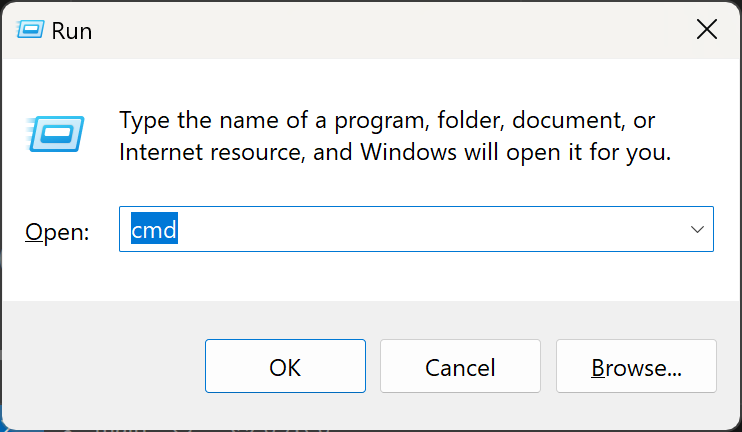
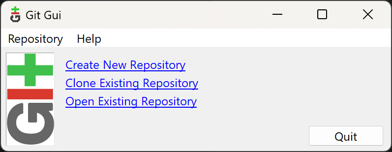
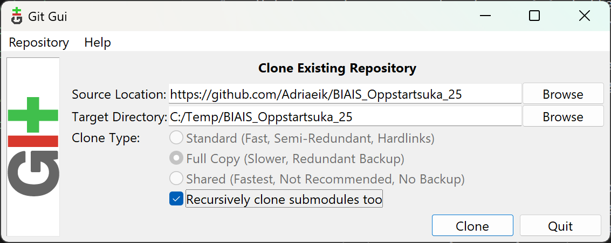
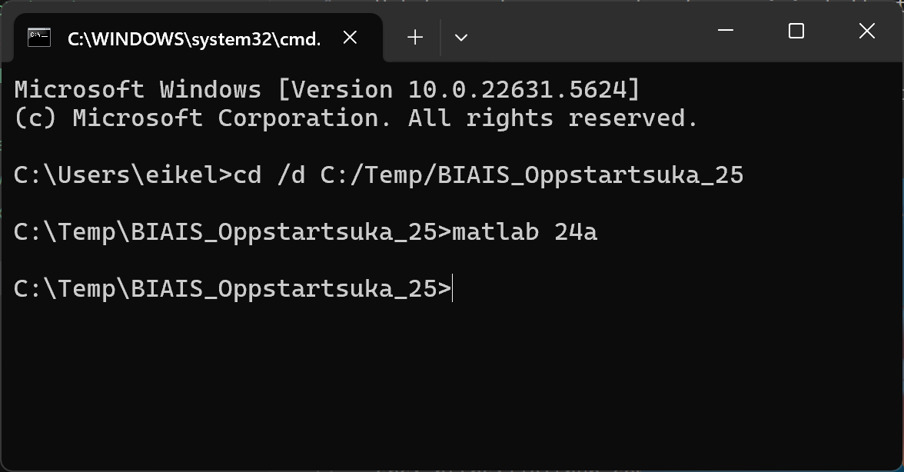

### Hurtigtips

Disse PC-ene kan plutselig bytte til amerikansk tastaturoppsett. Skjer det, trykk **Ctrl + Shift**, så fungerer tastaturet som normalt igjen.

---

## Klone prosjektet med Git GUI

1. **Åpne «Kjør»-vinduet**
   Trykk **Windows + R**. Et lite felt vises nederst til venstre.
   

2. **Start Git GUI**
   Skriv `git gui` og trykk **Enter**. Git GUI-vinduet åpnes.
   

3. **Velg «Clone Existing Repository»**
   (Et *repository* er ganske enkelt et prosjektarkiv.)

4. **Fyll inn Source og Target**

   | Felt   | Verdi                                               |
   | ------ | --------------------------------------------------- |
   | Source | `https://github.com/Adriaeik/BIAIS_Oppstartsuka_25` |
   | Target | `C:/Temp/BIAIS_Oppstartsuka_25`                     |

   

   > Får du en advarsel om at mappen allerede finnes, endrer du bare mappenavnet under `C:/Temp/` før du kloner.

5. **Lukk Git GUI**
   Når kloningen er fullført og et nytt vindu dukker opp, kan du ganske enkelt lukke det. Git-delen er ferdig.

---

## Kjøre prosjektet i MATLAB

6. **Åpne ledeteksten (CMD)**
   Trykk **Windows + R**, skriv `cmd`, og trykk **Enter**.

7. **Gå til prosjektmappen**

   ```cmd
   cd /d C:/Temp/BIAIS_Oppstartsuka_25
   ```

   Trykk **Enter**.
      > om du endret du mappenavnet under `C:/Temp/` må du endre `BIAIS_Oppstartsuka_25` til dette navnet.


8. **Start riktig MATLAB-versjon**

   ```cmd
   matlab 24a
   ```

   Trykk **Enter** og vent tålmodig mens MATLAB starter. Etter punkt 6 til 8 skal det se slik ut på skjermen.
   

9. **Åpne første oppgave**
   I MATLAB: Naviger til `del1/oppgave1.slx` og åpne filen. Nå er du klar til å sette i gang!
