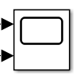
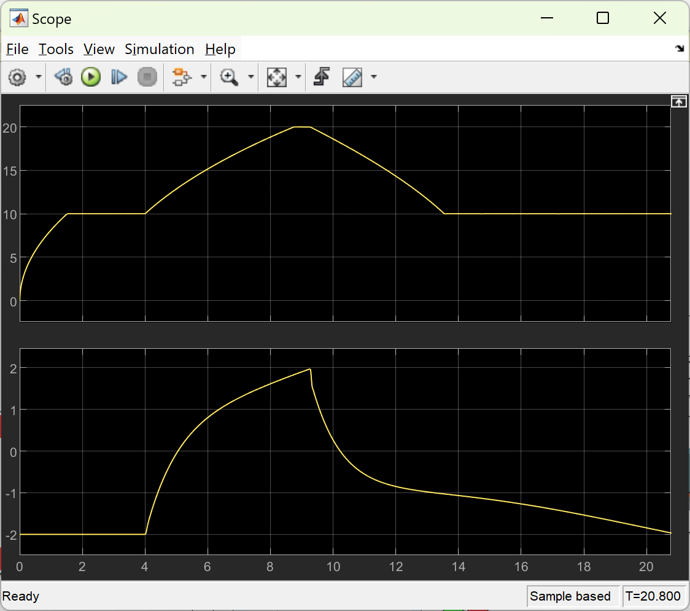
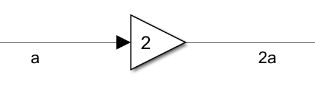
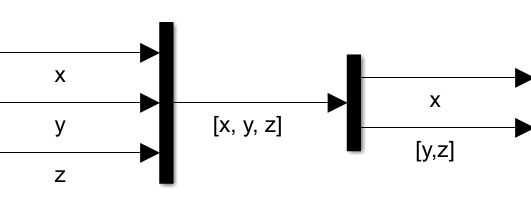

## Rask Simulink-intro

### Redigere blokker

De fleste blokker kan åpnes og endres ved å dobbeltklikke på dem. For eksempel: dobbeltklikk på de små trekantene i **PID-regulatoren** for å justere parametrene.

### Stop Time

Øverst i verktøylinjen, under fanen **Simulation**, finner du feltet **Stop time**. Verdien der bestemmer hvor lenge simuleringen skal kjøres.

### Scope

Blokken **Scope** viser signalverdier som funksjon av tid. Resultatet vises som en graf når du dobbeltrykker på scope ikonet i simulink.

### Integrator $\frac{1}{s}$

Blokken **$\frac{1}{s}$** er en integrator i $s$-domenet. Foreløpig trenger du bare å vite at den utfører integrasjon av ein verdi med hensyn på tid.

### Gain

Blokken **Gain** multipliserer inngangssignalet med en skalarverdi.

### Mux og Demux

* **Mux** kombinerer flere separate signaler til ett vektorsignal.
* **Demux** deler et vektorsignal opp i flere individuelle signaler.
  
