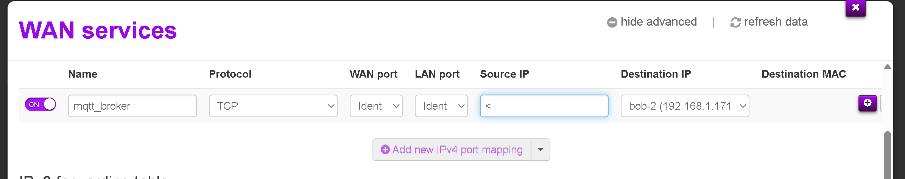

Gå inn på no ser vi rett skjermbilde for port forwarding. Her er nøyaktig kva du skal fylle inn:

---

## ✅ Fyll inn slik:

| Felt            | Verdi                          |
|------------------|--------------------------------|
| **Name**         | `mqtt_broker` (som du har)     |
| **Protocol**     | `TCP`                          |
| **WAN port**     | `1884`                         |
| **LAN port**     | `1884`                         |
| **Source IP**    | `All` eller `<` (som du har)   |
| **Destination IP** | `bob-2 (192.168.1.171)` *(det er PC-en din)* |

---

✅ Dette betyr:
- All trafikk som kjem til `46.212.5.36:1884` vil bli sendt til `192.168.1.171:1884`
- Du har dermed gjort MQTT-brokeren din tilgjengeleg frå internett!

---

## 🔄 Etterpå:
1. Trykk på **lagre eller "apply"** (kan vere eit ikon med diskett eller hake)
2. Gå tilbake til startsida og kontroller at regelen er aktiv (ON)

---

## 🧪 Test frå ein annan PC eller 4G-nett:

```bash
mosquitto_pub -h 46.212.5.36 -p 1884 -t test -m "hei frå utsida" -u brukarnamn -P passord
```

Og lytt frå ein annan klient:

```bash
mosquitto_sub -h 46.212.5.36 -p 1884 -t test -u brukarnamn -P passord
```

---
